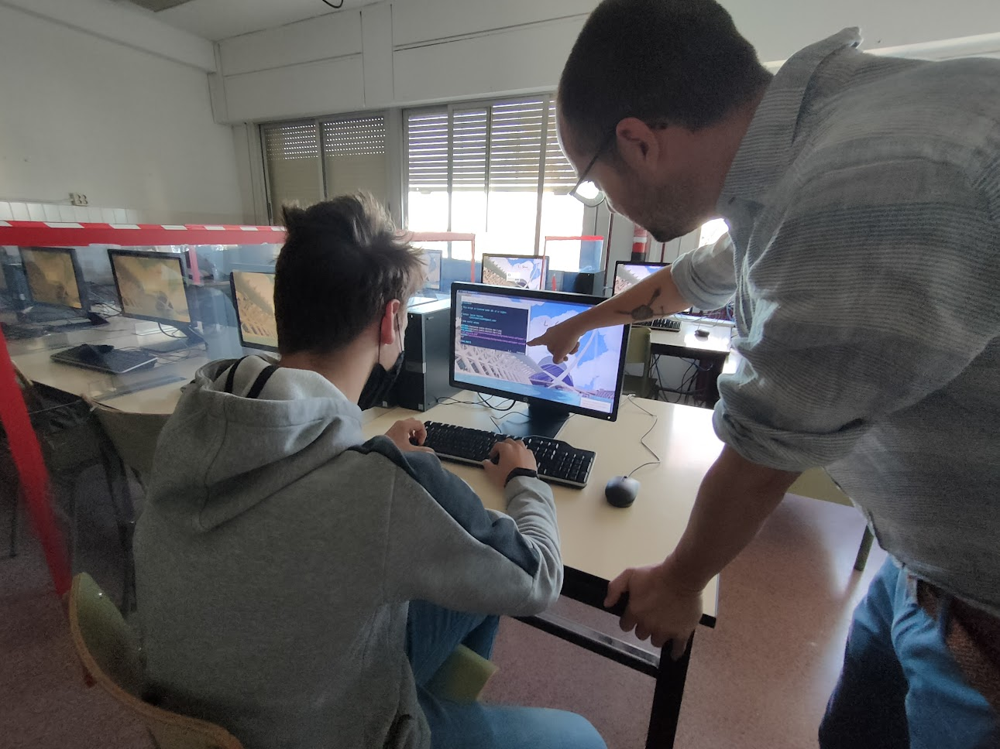

\tableofcontents

\newpage
# Introducción

En este pequeño artículo se presenta una experiencia llevada a cabo por el Departamento de Informática del IES La Sénia de Paiporta 
en el que se describe cómo el Alumnado del primer curso de Grado Medio del Ciclo de Sistemas Microinformáticos y Redes, lleva a cabo 
en el centro un pequeño desarrollo de una herramienta destinada a mejorar el mantenimiento y asistencia de los Ordenadores del IES.

A lo largo del artículo se describe cuáles son algunas de las metodologías de trabajo que el profesorado del ciclo lleva a cabo con los alumnos y cómo 
se pueden mejorar y *afinar* las herramientas para adecuarlas al entorno de trabajo.

Por último se describen algunas de las *Unidades de Competencia* que se han puesto en marcha a la hora de detectar/desarrollar e implementar
el proyecto, así como una serie de actividades que podrían llevarse a cabo para seguir trabajando con el alumnado.

Este proyecto ha sido desarrollado por los integrantes del Equipo de Docentes de Grado Medio de Informática:

- Patxi Sanchis Luis.
- Diego Carrasco.
- Javier Polit.
- Javier Daroqui.
- César Tomas Franco.
- Angel Berlanas Vicente.

\newpage
# SMX y el Mantenimiento

Una de las filosofías principales del IES La Sénia es poner el alumnado en el centro de la educación, dándole protagonismo y permitiendo que 
forme parte activa y crítica de la comunidad educativa a la que pertenece.

Dentro de esta filosofía y teniendo en cuenta los Cuatro Saberes Fundamentales de la Formación Profesional:

- *Saber* 
- *Saber hacer*
- *Saber estar*
- *Saber ser*

Se tomó la decisión de fomentar que las incidencias técnicas que tienen lugar a diario en el IES sean resueltas (con apoyo, si es necesario) por el alumnado de Grado Medio.

En la resolución de estas incidencias el alumnado *debe* poner en juego lo aprendido durante el curso en los diferentes módulos que integran el ciclo. Algunos de los procesos cognitivos y técnicos que se ponen en juego en la resolución de este tipo de situaciones son los siguientes:

- Trato con el personal (docente o alumnado) que ha detectado la incidencia o la ha causado (*saber estar*).
- Análisis del problema.
- Reproducibilidad del mismo (uno de los primeros pasos para poder solventar cualquier problema).
- Elaboración de Hipótesis de solución, a partir de los conocimientos adquiridos (*saber*).
- Puesta en marcha de una solución (*saber hacer*). 
- Pruebas y detección de errores (*saber hacer*).
- Aceptación de la solución y propuestas de mejora (*saber ser*).

En este proceso, el alumnado toma conciencia de las diferentes problemáticas que se tienen con el uso de la tecnología, le permite tomar decisiones, desarrolla la creatividad, el análisis de la situación y pone en juego *en la práctica* los conceptos que se le han ido presentando en los diferentes módulos.

El verdadero potencial de esta actividad consiste en que el alumnado se transforma en un agente activo de su mundo, al tener la responsabilidad de mejorarlo no sólo para si mismo, sino para la comunidad que le rodea. Esta responsabilidad hace útil lo aprendido, más allá de tareas entregables, exámenes, y *kahoots*. El alumnado está *mejorando su entorno*, utilizando *lo que él sabe* y *lo que sabe hacer*. 

Este tipo de aprendizaje, también conocido como  *Aprendizaje Basado en Servicios* (ABS), va más allá del famoso *Aprendizaje Basado en Proyectos* (ABP) y forma parte de las metodologías más efectivas que se pueden realizar.[@puig2007aprendizaje]

Desde el Departamento de Informática llevamos varios años poniéndolo en práctica con el alumnado y participando en diferentes proyectos de colaboración con *ONGs* y Fundaciones.

En este pequeño artículo tan sólo trataremos el desarrollo de una pequeña propuesta, pero esperamos que sirva de ejemplo de todo lo que este tipo de implicación puede aportar a la práctica educativa.

Es importante destacar que en todo el IES utilizamos GNU/LinuX como distribución en todos los ordenadores, así que las herramientas que se describen y utilizan son de acceso gratuito y libre, reduciendo la brecha digital y fomentando la curiosidad y los valores del Software Libre dentro de la Comunidad Educativa [@adell2007software].

\newpage
# Detectando el problema

Durante las labores de resolución de incidencias, una de las primeras tareas a realizar en cada una de las intervenciones es la obtención de la **Dirección IP** del equipo que presenta el problema. Esto permite al alumnado una posibilidad de realizar la *asistencia* sin tener que estar en la clase y poder hacerlo de manera *remota* desde su ordenador del Aula.

Esto se consigue utilizando *SSH*, la herramienta que permite a todo el centro estar mantenido y actualizado con un mínimo de personal y sin tener que estar físicamente en el aula que presenta el problema, haciendo el trabajo del técnico de manera *invisible*, pero *efectiva*.

En esa obtención de la IP, el alumno ha de iniciar sesión en el equipo y ejecutar alguna orden desde consola (*lo más rápido*), o comprobar mediante alguna herramienta gráfica, cuál es la IP del equipo. 

Esto pueden ser algunos segundos, pero cuando la incidencia requiere comprobar las direcciones IP de toda una fila de ordenadores, estar iniciando sesión en cada uno de ellos, para salir una vez hemos obtenido la IP puede resultar una tarea repetitiva y tediosa. Y al más puro estilo español, que *agudiza el ingenio* cuando a trabajar menos se refiere, a algunos alumnos se les ocurrió la idea de que la IP apareciera en la pantalla de inicio de sesión, antes de que el usuario tuviera que iniciar sesión en el equipo.

Con esta solución, podemos comprobar rápidamente situaciones cómo:

- La IP asignada está dentro del Rango del DHCP.
- El estado de la conectividad del cable.
- El nombre del equipo.
- La pertenencia a una determinada aula o a la red del centro, dependiendo de la máscara.
- ...

\newpage
# Proponiendo la mejora

Una vez propuesta la idea, se valoró por parte del equipo docente la posibilidad de configurar el servicio de `lightdm` para que mostrara dicha información. Sin embargo, la posibilidad de poder ampliar la información mostrada más adelante hacía más complicada la configuración del `lightdm`. Con lo que se propuso la siguiente solución:

La elaboración de un *script* que al ejecutarse en cada arranque obtuviera un texto que se añadiría sobre una pequeña *cookie* en la parte inferior derecha del fondo de pantalla, sobrescribiendo el fichero del fondo en cada ejecución. 

Este script debía:

- Obtener el nombre del equipo.
- Obtener el estado de la conexión.
- Obtener la IP de la conexión. En caso de tener más de una conexión (equipos portátiles o con tarjetas virtuales), se debía mostrar aquella que pertenecía a la red del centro: 172.29.0.0/23.

Una vez obtenida dicha información, se utilizaría el fichero del fondo de pantalla para generar uno nuevo que incluyera esta información.

\newpage
# Implementando la mejora

El alumnado separó la solución en dos scripts independientes, por una lado la obtención de la información y por otro la modificación de la imagen, permitiendo así más fácilmente la modificación del programa para incluir más información en caso de que se requiera. Esto es muy de la Filosofía UNIX[^UNIX].

Los dos scripts resultantes fueron incorporados al repositorio de Software de La Sénia:

- [senia-network-info](https://github.com/aberlanas/senia-cdd/blob/master/senia-backgrounds.install/usr/bin/senia-network-info)
- [senia-cookie-info-wallpaper](https://github.com/aberlanas/senia-cdd/blob/master/senia-backgrounds.install/usr/bin/senia-cookie-info-wallpaper)

Estos dos *scripts* fueron utilizados por un pequeño *OneShot* de Systemd para ejecutarse durante el arranque:

- [senia-backgrounds.service](https://github.com/aberlanas/senia-cdd/blob/master/debian/senia-backgrounds.service)

El OneShot fue diseñado por el alumnado, y desarrollado con ayuda del equipo de docentes del Departamento. Durante el desarrollo se aprovechó para explicar cómo funciona el Sistema de Arranque de las Distribuciones GNU/LinuX basadas en `systemd`.

[^UNIX]:https://es.wikipedia.org/wiki/Filosof%C3%ADa_de_Unix

\newpage
# Pruebas

Una vez incluido el Software dentro del paquete de `senia-backgrounds` y subido este al [PPA de la Infraestructura del IES La Sénia](https://launchpad.net/~ticsenia/+archive/ubuntu/ppa/), el alumnado actualizó los equipos del Aula 1 de Informática, comprobando que el resultado era el esperado.

\

Tras algunas pruebas, modificaciones y comprobaciones se pasó a actualizar el centro, detectando durante el proceso algunas modificaciones que se podrían incluir para mejorar más la información obtenida.

\newpage
# Unidades de Competencia y Resultados de Aprendizaje

El desarrollo y puesta en marcha de un proyecto como este involucra diferentes Unidades de Competencia y Resultados de Aprendizaje que se encuentran en diferentes módulos. Otorgando a estos proyectos un valor más grande si cabe al ofrecer una visión *globalizada* de todo lo aprendido durante el curso: 

- *Lo que he aprendido tiene utilidad para mi y mi entorno.*

Sería una posible conclusión a la que el alumnado puede llegar al realizarlo.

A continuación se describe en varias tablas los diferentes Resultados de Aprendizaje de los Módulos implicados:

## Módulo Profesional : Sistemas Operativos Monopuesto

| Resultado de Aprendizaje | 
|:------------------------:|
| 3. Realiza tareas básicas de configuración de sistemas operativos, interpretando requerimientos y describiendo los procedimientos seguidos.  

| Id. |Criterios de Evaluación | 
|:---:|:--------------------:|
| e) |Se ha realizado la configuración para la actualización del sistema operativo. |
| f) |Se han realizado operaciones de instalación/des-instalación de utilidades. |
| g) |Se han utilizado los asistentes de configuración del sistema (acceso a redes, dispositivos, entre otros).| 
| h) |Se han ejecutado operaciones para la automatización de tareas del sistema. |

----

| Resultado de Aprendizaje | 
|:------------------------:|
| 4. Realiza operaciones básicas de administración de sistemas operativos, interpretando requerimientos y optimizando el sistema para su uso.|

| Id. |Criterios de Evaluación | 
|:---:|:--------------------:|
| d)  |Se ha actuado sobre los servicios del sistema en función de las necesidades puntuales. |
| i)  |Se ha interpretado la información de configuración del sistema operativo. |

## Módulo Profesional : Redes Locales

| Resultado de Aprendizaje | 
|:------------------------:|
| 1. Reconoce la estructura de redes locales cableadas analizando las características de entornos de aplicación y describiendo la funcionalidad de sus componentes. |

| Id. |Criterios de Evaluación | 
|:---:|:--------------------|
|b) |Se han identificado los distintos tipos de redes.|
|d) |Se han identificado y clasificado los medios de transmisión. |
|e) |Se ha reconocido el mapa físico de la red local. |
|f) |Se han utilizado aplicaciones para representar el mapa físico de la red local.|

-----

| Resultado de Aprendizaje | 
|:------------------------:|
| 4. Instala equipos en red, describiendo sus prestaciones y aplicando técnicas de montaje. |

| Id. |Criterios de Evaluación | 
|:---:|:--------------------|
|  d) |Se han configurado los modos de funcionamiento y los parámetros básicos. | 
|  e) |Se ha comprobado la conectividad entre diversos dispositivos y adaptadores inalámbricos.| 
|  f) | Se ha instalado el software correspondiente. | 
|  g) | Se han identificado los protocolos. | 
|  h) | Se han configurado los parámetros básicos. | 
|  i) |Se han aplicado mecanismos básicos de seguridad.| 

----

| Resultado de Aprendizaje | 
|:------------------------:|
| 5. Mantiene una red local interpretando recomendaciones de los fabricantes de hardware o software y estableciendo la relación entre disfunciones y sus causas.|

| Id. |Criterios de Evaluación | 
|:---:|:--------------------|
| a)  | Se han identificado incidencias y comportamientos anómalos.|
| b)  | Se ha identificado si la disfunción es debida al hardware o al software.|
| c)  | Se han monitorizado las señales visuales de los dispositivos de interconexión. |
| d)  | Se han verificado los protocolos de comunicaciones. | 
| e)  | Se ha localizado la causa de la disfunción. |
| f)  | Se ha restituido el funcionamiento sustituyendo equipos o elementos.  |
| g)  | Se han solucionado las disfunciones software (configurando o reinstalando). |
| h)  | Se ha elaborado un informe de incidencias.| 

\newpage
# Posibles actividades adicionales

Mientras se realizaba la actividad, tanto el profesorado como el alumnado fueron proponiendo ideas para mejorar el Software y la solución desplegada. A continuación se proponen algunas ideas que, tomando como base la solución elegida, se pueden desarrollar extendiendo y mejorando la funcionalidad.

- Ejecución periódica del `OneShot` hasta que tenga IP el equipo, ya que en determinados equipos (típicamente los que disponen de un disco duro de estado sólido), `systemd` ejecuta demasiado pronto el script.
- Inclusión de la versión de actualización de la distribución del IES (`senia-cdd`) en la *galleta* que se *sobreimprime* en el fondo.
- Detección del tamaño de la imagen de fondo para un mejor ajuste de la información.
- Investigación del orden de arranque de los servicios en `systemd` para adecuar la ejecución al final del arranque.
- Comentar el código propuesto por el alumnado, mejorando la legibilidad.
- Aceptar parámetros para *customizar* la información mostrada.
- Creación de un pequeño asistente que genere un fichero de configuración, permitiendo al administrador seleccionar *qué* se muestra en determinados equipos.

\newpage
# Conclusiones

El trabajo e implementación de todas estas actividades es posible en gran medida debido a que en el IES La Sénia contamos con una Infraestructura basada en Software Libre, que nos permite adaptar, modificar, entender y aprender de *cómo funcionan* los Sistemas Operativos y el *Hardware*. Demostrando al alumnado que lo que ocurre en los Sistemas no es *magia*, sino que está programado por seres humanos que desarrollan código con unos propósitos concretos y tratando de resolver los problemas que se les plantean en su vida diaria.

Tratar a los Sistemas Operativos como lo que son, un conjunto *entendible* de piezas de software y no meros instrumentos para lanzar aplicaciones, permite al alumnado y al profesorado tomar conciencia de *cómo funcionan las cosas* y si se tiene la curiosidad suficiente comprobar que el mundo de la informática es un puzzle resoluble y comprensible por nosotros mismos.

Citando a Morfeo en *Matrix*:

*“Si tomas la pastilla azul, fin de la historia: despertarás en tu cama y creerás lo que quieras creerte. Si tomas la roja te quedarás en el País de las Maravillas, y yo te enseñaré hasta dónde llega la madriguera de conejos”*

Lo que ofrece el Software Libre es exactamente eso, la capacidad de poder entrar en el País de las Maravillas. 

# Agradecimientos

- A todo el equipo docente de todo el Grado Medio de Informática.
- Al equipo directivo del IES La Sénia, por permitir que el alumnado nos ayude día a día a hacer un mejor instituto y una mejor comunidad educativa.

