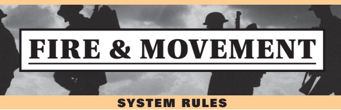

# [ AAR ] Gaza 1917 - Decision Games

## Descripción del juego

Gaza 1917 de Decision Games es un juego integrado dentro de la serie *folio* de Decision. Esta serie contiene diferentes juegos que cubren determinadas batallas y operaciones de varias épocas de la historia.

TODO: Caratula

En Decision tienen varios sistemas que forman la base de diferentes juegos y luego cada uno de ellos matiza o adapta esas reglas **base** para la batalla, escenario, operación,...

Este juego en concreto utiliza el *core* de reglas de *Fire & Movement* que es utilizado en diferentes escenarios de la IGM y la IIGM.

Ha sido mi primer juego de esta serie, y quiero destacar algunos aspectos del sistema que me han parecido interesantes.

## Fire & Movement

No detallaré el funcionamiento de todo el sistema, pero voy a enumerar ciertos aspectos que lo definen:

- 8 páginas de reglas (a triple columna),que están disponibles para descarga en la página de Decision.
- No se permite el apilamiento, lo que hace que todos los cálculos y decisiones sean más rápidos de tomar, podríamos decir que aumenta la legibilidad del escenario.
- Existen excepciones a esto, de hecho en *Gaza 1917* se permite el apilamiento de unidades, pero sólo por parte de los británicos y con acorazadas y tanques, lo que en la primera guerra mundial simula bien el uso de este tipo de unidades en los ejércitos.
- Las **ZOC** son *duras*, obligan a detenerse y cuestan muchos puntos de movimiento.
- La **CRT** es muy sencilla de aplicar y para mí es novedosa, se resta el ataque de la defensa y el resultado se mira en una tabla que tiene en cuenta los diferentes tipos de terreno. Se juega con 1d6 y los resultados bajos son mejores que los altos (1>6).

