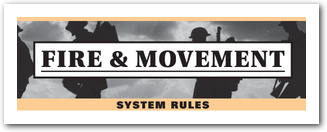

# [ AAR ] Gaza 1917 - Decision Games

## Descripción del juego

Gaza 1917 de Decision Games es un juego integrado dentro de la serie *folio* de Decision. Esta serie contiene diferentes juegos que cubren determinadas batallas y operaciones de varias épocas de la historia.

Se presenta en un bolsa *zip* y su precio no excede los 20 euretes.

TODO: Caratula

En Decision tienen varios sistemas que forman la base de diferentes juegos y luego cada uno de ellos matiza o adapta esas reglas **base** para la batalla, escenario, operación,...

Este juego en concreto utiliza el *core* de reglas de *Fire & Movement* que es utilizado en diferentes escenarios de la IGM y la IIGM.

Ha sido mi primer juego de esta serie, y quiero destacar algunos aspectos del sistema que me han parecido interesantes.

## Fire & Movement

No detallaré el funcionamiento de todo el sistema, pero voy a enumerar ciertos aspectos que lo definen:

- 8 páginas de reglas (a triple columna),que están disponibles para descarga en la página de Decision.
- No se permite el apilamiento, lo que hace que todos los cálculos y decisiones sean más rápidos de tomar, podríamos decir que aumenta la legibilidad del escenario.
- Existen excepciones a esto, de hecho en *Gaza 1917* se permite el apilamiento de unidades, pero sólo por parte de los británicos y con acorazadas y tanques, lo que en la primera guerra mundial simula bien el uso de este tipo de unidades en los ejércitos.
- Las **ZOC** son *duras*, obligan a detenerse y cuestan muchos puntos de movimiento.
- La **CRT** es muy sencilla de aplicar y para mí es novedosa, se resta el ataque de la defensa y el resultado se mira en una tabla que tiene en cuenta los diferentes tipos de terreno. Se juega con 1d6 y los resultados bajos son mejores que los altos (1>6).
- El uso de la artillería mediante chits me ha parecido adecuado para simular que no siempre viene bien utilizar la potencia de fuego.
- En las reglas generales los vehículos pueden combatir y bombardear en diferentes fases, lo que permite hacer determinados efectos y jugadas, otorgando flexibilidad, aunque en este *Gaza 1917* estas fases no se aplican (supongo que porque la presencia de blindados en este momento de la guerra sería anecdótica).
- Algunas reglas del core son matizadas o definidas para este escenario (que también viene en la bolsa zip), por destacar alguna:
    - La coordinación en el ataque de las unidades diferentes tiene un desplazamiento de columnas.
    - El alcance del bombardeo es diferente por bando y además tiene en cuenta las colinas.
    - Los refuerzos.
    - Los Puntos de Victoría y las posibles Victorias Automáticas.
    - Reabastecimiento de los *chits* de Bombardeo cada día.
    - Apilamientos especiales.

## Objetivos de la partida

El escenario enfrenta a las Potencias Centrales (CP de *Central Powers*) a una incursión británica cuyo objetivo era la toma de Jerusalen. Los alemanes y los otomanos defenderán Gaza y una serie de pequeñas poblaciones (debidamente atrincheradas) de las fuerzas británicas.

En el despliegue, las tropas británicas han de situarse al sur de Gaza, más allá de un rio/barranco.

La **Victoria Automática para los Británicos** pasa por controlar Gaza al final de cualquier turno (2 Hexágonos), además existe una carretera que marcha hacia el norte que permitirá un avance más rápido para las unidades británicas.

Las unidades alemanas en esta partida las he situado fuera de Gaza, bloqueando un paso que pudiera ser utilizado por los británicos para intentar embolsar a las Potencias Centrales.

Por parte de las Potencias Centrales: defender Gaza con algunas tropas de las pocas tropas de 3 pasos del juego ha sido la decisión que se ha tomado para esta partida. 

Otras unidades *resistentes* han sido situadas al sudeste del mapa, con el objetivo de que los británicos no puedan tomar todas las ciudades que contienen puntos de victoria.

## Desarrollo de la partida

**Aviso a Navegantes**: Redacto este apartado de manera continua.

Los británicos comenzaron a avanzar en línea hacia Gaza e intentando tomar todas las ciudades defendidas por las Potencias Centrales a la vez. A medida que las unidades Otomanas quedaban al alcance de la artillería británica se utilizaban todos los chits posibles para intentar diezmar las fuerzas defensivas en los diferentes asentamientos y cidudades. El intercambio de artillería (ya que los Otomanos también pueden responder a ese fuego), causa bajas en el ejército británico y ninguna en el bando de las Potencias Centrales.

El uso de la fuerza aérea por parte de los Otomanos hace posible el bombardeo de las unidades británicas más débiles y retrasadas, aunque no estuvieran al alcance de las tropas normales (esta regla me han encantado).

Cuando los británicos llegan hasta las diferentes ciudades fortificadas, defendidas por los Otomanos, comienzan los combates, donde la superioridad numérica de los británicos no se nota tanto, ya que al no poder coordinar ataques sin tener penalizaciones, se ven forzados a intentar asaltos donde un resultado de *Ex* (Exchange), les beneficia. Las trincheras (*Trenches*), sólo benefician a las Potencias Centrales, lo que hace que muchos asaltos no tengan éxito o sean rechazados. 

Concretamente en Gaza, las tropas británicas no tienen suerte y son rechazadas varias veces por las tropas defensoras + los refuerzos de caballeria que aparecen a lo largo de los turnos.

El uso de las órdenes de *Kress*, que tenemos en un *chit*, permite que determinados ataques de las tropas Otomanas y Alemanas se vean intensificados y mejorados, causando varias bajas decisivas en las tropas británicas.

## Final de partida y Conclusiones

